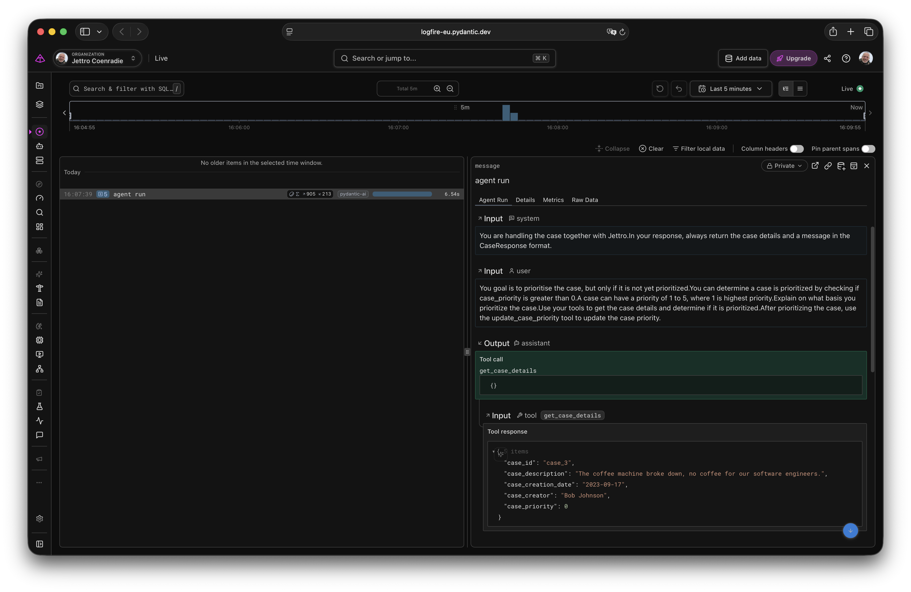

# Trying out Pydantic AI/Evals/Logfire

## Installation

```bash
# installs through the slim package only what we need
uv add "pydantic-ai-slim[logfire,openai]"

# dotenv for loading the environment variables from the .env file
uv add python-dotenv
```

## The first step

In general, an Agent does not implement a chat interface. With a chat, you send multiple messages and get a reply to the message you send. The agent does not work like that out of the box. You only provide a piece of text, and the agent replies to that piece of text.

```python
from pydantic_ai import Agent

Agent(
    name="Friendly Agent",
    description="A friendly agent that helps users with their tasks.",
    model="openai:gpt-5.6-luna",
    instructions="Always reply with a friendly message, you can never answer in a bad langauge."
)
```

## Case management and the case repository

For the next sample, I create a basic case management system. The goal is to determine the priority of a case. A case repository is available as two tools to the agent. The incoming request asks the agent to determine the priority of a case. Below is the outline of the repository class, the git project has the complete implementation if you are curious.

```python
class CaseRepository:
    def __init__(self):
        self.cases = {
        }

    async def get_case(self, case_id: str) -> Case:
        ...
    async def update_case_priority(self, case_id: str, priority: int) -> Case:
        ...
```

The repository methods are `async`, as a real case store is usually a remote system that you talk to over the network. In the sample, an `await asyncio.sleep(0.1)` stands in for that latency.

## Dependencies

Sometimes you want to keep specific data away from the agent, but make it available to tools. In the example, I want to provide the case_id, this should not be changeable by the Agent. This is one example of data that I can inject as a dependency.  

Another example is database clients, repositories, objects that are use but not maintained by the agent. I want to provide a case repository to the agent. This way, the agent can access the cases without having to know about the repository.

The dependencies are specified by an object. When you call the agent, you provide an instance of the object.

```python
from dataclasses import dataclass
from pydantic_ai import Agent, RunContext

# The dependency object definition
@dataclass
class CaseAgentDeps:
    case_id: str
    user_name: str
    case_repository: CaseRepository


# Tell the agent about the dependency
agent = Agent(
    model="openai:gpt-5.6-luna",
    deps_type=CaseAgentDeps,
    output_type=CaseResponse
)

```

Each method, like a tool call or instructions, receives the RunContext with the dependencies. In the next code block, you can see how to use the RunContext to access the dependencies.

```python
from pydantic_ai import Agent, RunContext

@agent.instructions
def personalize(ctx: RunContext[CaseAgentDeps]):
    return (f"You are handling the case together with {ctx.deps.user_name}."
            f"In your response, always return the case details and a message in the {CaseResponse.__name__} format.")

```

## Using tools, and introduce annotations for configuration

Another way of initializing an Agent is using annotations, these allow you to present more advanced configurations a lot better. Lets dive into a new example. I want to start an Agent by a specific user for a fixed case. So this instance of the agent is not allowed to switch cases. Through the dependency mechanism, I can provide an object with data used by the agent, but also provided to the tools and the mentioned annotations.

The next code block shows the complete construction of the agent.

```python
def create_case_agent():
    agent = Agent(
        model="openai:gpt-5.6-luna",
        deps_type=CaseAgentDeps,
        output_type=CaseResponse
    )

    @agent.instructions
    def personalize(ctx: RunContext[CaseAgentDeps]):
        return (f"You are handling the case together with {ctx.deps.user_name}."
                f"In your response, always return the case details and a message in the {CaseResponse.__name__} format.")

    @agent.tool()
    async def get_case_details(ctx: RunContext[CaseAgentDeps]) -> Case:
        case = await ctx.deps.case_repository.get_case(ctx.deps.case_id)
        return case

    @agent.tool()
    async def store_case_priority(ctx: RunContext[CaseAgentDeps], new_priority: int) -> None:
        await ctx.deps.case_repository.update_case_priority(ctx.deps.case_id, new_priority)

    return agent
```

Tools can be sync or async. Pydantic AI runs a sync tool in a thread pool, an async tool runs on the event loop itself. As soon as a tool does I/O, an HTTP call or a database query, make it `async def` and `await` the call. That way the event loop is free to do other work while the tool waits.

This is the version of the agent with two tools. In the section about the output, I promote `store_case_priority` to the output of the agent, the code in the repository no longer has it as a tool.

## Calling the agent

Next, you need to call the agent with the user instructions and the required dependencies. Notice how I create the instances in the code block for `CaseAgentDeps` and `CaseRepository`.

```python
async def main_case():
    agent = create_case_agent()
    result = await agent.run(
        user_prompt=(f"You goal is to prioritise the case, but only if it is not yet prioritized."
                     f"You can determine a case is prioritized by checking if case_priority is greater than 0."
                     f"A case can have a priority of 1 to 5, where 1 is highest priority."
                     f"Explain on what basis you prioritize the case."
                     f"Use your tools to get the case details and determine if it is prioritized."
                     f"Finish by storing the priority you determined, or by rejecting the prioritization."),
        deps=CaseAgentDeps(
            case_id="case_3",
            user_name="Jettro",
            case_repository=CaseRepository()
        )
    )
    print(result.output)
```

## The output of the agent

Up to here, the agent used `output_type=CaseResponse`, a dataclass. That is the simplest structured output, and it helps to know what happens under the hood. Pydantic AI generates a JSON schema for `CaseResponse`, registers it with the model as an extra tool and ends the run as soon as the model calls that tool. That is *tool output* mode, the default. An output does not have to be structured data though, it can be plain text, an image, or the result of a function that the model calls with arguments it provides. The documentation describes that last one as the way to further process or validate the data provided through the arguments, with the option to tell the model to try again, or to hand off to another agent. Those are exactly the three things I wanted to try.

### A function as the output

The `store_case_priority` tool has two problems. The model can call it with `new_priority=9` and nothing pushes back, and after the call the model still has to invent a `CaseResponse` on its own. An *output function* fixes both. The model has to call one of the output options, that call ends the run, and the return value of the function becomes the output of the run. It is not fed back to the model.

```python
async def case_to_prioritize(ctx: RunContext[CaseAgentDeps], new_priority: int) -> Case:
    """Validate the priority and the case, raise a ModelRetry when the model has to try again."""
    if not 1 <= new_priority <= 5:
        raise ModelRetry(f"A priority of {new_priority} is not allowed, pick a number from 1 to 5.")

    case = await ctx.deps.case_repository.get_case(ctx.deps.case_id)
    if case.case_priority > 0:
        raise ModelRetry(f"Case {case.case_id} already has priority {case.case_priority}, "
                         f"return a {PriorityRejected.__name__} instead.")
    return case


def create_case_agent() -> Agent[CaseAgentDeps, CaseResponse | PriorityRejected]:
    async def store_priority(ctx: RunContext[CaseAgentDeps], new_priority: int, motivation: str) -> CaseResponse:
        """Store the priority you determined for the case and finish the run."""
        case = await case_to_prioritize(ctx, new_priority)
        updated_case = await ctx.deps.case_repository.update_case_priority(case.case_id, new_priority)
        return CaseResponse(case=updated_case, message=motivation)

    return build_case_agent(store_priority)


def build_case_agent(
        output_function: Callable[[RunContext[CaseAgentDeps], int, str], Awaitable[CaseResponse]]
) -> Agent[CaseAgentDeps, CaseResponse | PriorityRejected]:
    agent = Agent[CaseAgentDeps, CaseResponse | PriorityRejected](
        model="openai:gpt-5.6-luna",
        deps_type=CaseAgentDeps,
        output_type=[ToolOutput(output_function, name="store_priority", max_retries=2), PriorityRejected],
        retries={"output": 2},
    )

    @agent.instructions
    def personalize(ctx: RunContext[CaseAgentDeps]):
        return (f"You are handling the case together with {ctx.deps.user_name}."
                f"Determine the priority with the case details, then finish the run by storing the priority."
                f"When the case must not be prioritized, finish with a {PriorityRejected.__name__} instead.")

    @agent.tool()
    async def get_case_details(ctx: RunContext[CaseAgentDeps]) -> Case:
        case = await ctx.deps.case_repository.get_case(ctx.deps.case_id)
        return case

    return agent
```

A few details are easy to miss.

The function is not registered as a tool anymore. You typically do not want the same function as both a tool and an output function, the model gets confused about which one to call. The write to the repository and the returned `CaseResponse` now live in the same place, which is exactly what I wanted.

`ModelRetry` is the channel to say *please try again*. The message goes back to the model and it gets another attempt. Every retry consumes the output retry budget, which defaults to 1. You raise it with `retries={"output": 2}` on the agent, or per output tool with `ToolOutput(..., max_retries=2)`.

The docstring of the function becomes the tool description and the arguments become the schema. So `motivation: str` gives the *explain on what basis you prioritize the case* instruction a typed home, instead of leaving it in the prompt text and hoping for the best.

`ToolOutput(..., name="store_priority")` pins the name of the output tool. That is not cosmetic, the tests below call that name directly instead of looking it up.

Because the output is a list, and the function is async, the type checker needs a hand. The explicit `Agent[CaseAgentDeps, CaseResponse | PriorityRejected]` is what makes the inferred output type come out right, the pydantic ai output documentation has a whole section about these type checking considerations.

### More than one possible output

`output_type=[store_priority, PriorityRejected]` registers two output tools, so the agent can end in two ways. "I prioritized the case" and "I am not going to prioritize this case" are two different types now, instead of one dataclass with a `message` field where I have to read the prose to find out what happened.

```python
class PriorityRejected(BaseModel):
    """Use me when the case must not be prioritized, for example because it already has a priority."""

    reason: str
```

The docstring of the model is the description the model sees, so it doubles as the instruction on when to pick this output. In `main.py` the caller branches on the type.

```python
    match result.output:
        case CaseResponse() as response:
            print(f"Priority {response.case.case_priority}: {response.message}")
        case PriorityRejected() as rejected:
            print(f"Not prioritized: {rejected.reason}")
```

Two variants I did not use, but are good to know. Adding `str` to the list (`output_type=[store_priority, PriorityRejected, str]`) lets the model ask a clarifying question instead of committing to one of the two. Adding `None` (`output_type=[store_priority, None]`) is the documented way to let an agent finish without a final message, for the case where all the real work happened in the tools and there is nothing left to say.

### Handing off to another agent

An output function can call another agent. In the sample, the case agent stores the priority and lets a second agent turn the internal motivation into a message for the reporter of the case.

```python
message_agent = Agent(
    model="openai:gpt-5.6-luna",
    output_type=str,
    instructions="You turn an internal case note into a short, friendly message for the reporter of the case.",
)


def create_case_agent_with_hand_off() -> Agent[CaseAgentDeps, CaseResponse | PriorityRejected]:
    async def hand_off_to_message_agent(ctx: RunContext[CaseAgentDeps], new_priority: int,
                                       motivation: str) -> CaseResponse:
        """Store the priority and let the message agent phrase the reply to the reporter of the case."""
        case = await case_to_prioritize(ctx, new_priority)
        updated_case = await ctx.deps.case_repository.update_case_priority(case.case_id, new_priority)

        # drop the output tool call, it should not be passed on to the other agent
        messages = ctx.messages[:-1]
        try:
            result = await message_agent.run(motivation, message_history=messages)
        except UnexpectedModelBehavior as e:
            if (cause := e.__cause__) and isinstance(cause, ModelRetry):
                raise ModelRetry(f"The message agent failed: {cause.message}") from e
            raise

        return CaseResponse(case=updated_case, message=result.output)

    return build_case_agent(hand_off_to_message_agent)
```

`ctx.messages[:-1]` strips the output tool call before the history goes to the other agent, the call is not part of the conversation the second agent should see. Re-raising a nested `ModelRetry` as a `ModelRetry` of my own turns a failure of the inner agent into another attempt for the outer one, instead of an exception that ends the run. In Logfire this shows up as an `agent run` span nested inside the first one.

### Three levels of failure

The documentation scatters the error handling, it helped me to split it in three levels.

1. Retryable, the model made a mistake. Raise `ModelRetry` in the output function, or in an `@agent.output_validator`. The message goes back to the model, bounded by the output retry budget.
2. Not retryable, but still a valid outcome. Model it as a type, like `PriorityRejected`. The model correctly concluding that it cannot do something is not an error, so it should not travel through the exception path at all.
3. Broken, my problem. Let it bubble out of `agent.run()` and catch it in `main.py`. `UnexpectedModelBehavior` means the retries ran out, the last `ModelRetry` is in `__cause__`. Next to that there are `UsageLimitExceeded` and `ModelHTTPError`. Worth knowing, `ToolFailed` is not supported in output functions and output validators, there it counts as an ordinary exception and aborts the run.

An `@agent.output_validator` is the alternative for level one, it runs for every output type and it can do I/O. The documentation recommends an output function over a validator as soon as you would write `isinstance` checks in the validator, which is what two output types would force me to do.

### Other output modes

The structured output in this example goes through tool output mode, the default. The same types can go through two other modes. `NativeOutput([...])` lets the provider enforce the JSON schema itself, `PromptedOutput([...])` injects the schema into the instructions, which is what you need for a model without tool calling.

```python
from pydantic_ai import NativeOutput

agent = Agent(
    model="openai:gpt-5.6-luna",
    output_type=NativeOutput([CaseResponse, PriorityRejected]),
)
```

`ToolOutput`, `NativeOutput` and `PromptedOutput` are markers around the same types, they change how the output travels, not what it is.

## Adding Logfire instrumentation

I prefer to use the environment property for the access to Logfire. This way, I only have to add the key to the .env file.

The following lines are required to ingest telemetry into Logfire. Below is the output of the run, recorded with the version of the agent that still had `store_case_priority` as a tool.

```text
/opt/homebrew/bin/uv run /Users/jettrocoenradie/Development/personal/pydantic-ai-tryout/.venv/bin/python /Users/jettrocoenradie/Development/personal/pydantic-ai-tryout/main.py 
Logfire project URL: https://logfire-eu.pydantic.dev/jettro/starter-project
09:14:41.040 agent run
09:14:41.042   chat gpt-5.6-luna
09:14:43.458   running tool: get_case_details
09:14:43.460   chat gpt-5.6-luna
09:14:44.982   running tool: store_case_priority
09:14:44.987   chat gpt-5.6-luna
CaseResponse(case=Case(case_id='case_3', case_description='The coffee machine broke down, no coffee for our software engineers.', case_creation_date='2023-09-17', case_creator='Bob Johnson', case_priority=3), message='The case was not previously prioritized (priority 0), so I assigned priority 3, reflecting a moderate operational impact: the broken coffee machine affects the software engineering team but does not indicate a critical business or safety issue.')
```

```python
import logfire

logfire.configure()
logfire.instrument_system_metrics()
logfire.instrument_pydantic_ai()
```



## Testing the agent without calling the model

Testing an agent should not cost you tokens. Pydantic AI ships two model implementations for that: `TestModel` calls every tool of the agent and makes up an output, `FunctionModel` lets you write the model as a function, so you decide which tool is called with which arguments. With `agent.override(model=...)`, you swap the model for the duration of the test, the agent itself stays untouched.

```bash
uv add --dev pytest pytest-asyncio
```

```python
@pytest.mark.asyncio
async def test_agent_run_stores_the_priority_chosen_by_the_model(case_agent_deps, case_repository):
    async def scripted_model(messages: list[ModelMessage], info: AgentInfo) -> ModelResponse:
        step = len([message for message in messages if isinstance(message, ModelResponse)])
        if step == 0:
            return ModelResponse(parts=[ToolCallPart("get_case_details", {})])
        return ModelResponse(parts=[ToolCallPart("store_priority",
                                                 {"new_priority": 3,
                                                  "motivation": "The coffee machine blocks the engineers."})])

    agent = create_case_agent()

    with agent.override(model=FunctionModel(scripted_model)):
        result = await agent.run(user_prompt=USER_PROMPT, deps=case_agent_deps)

    assert isinstance(result.output, CaseResponse)
    assert result.output.case.case_priority == 3
    assert result.output.message == "The coffee machine blocks the engineers."
    assert (await case_repository.get_case("case_3")).case_priority == 3
```

The last response of the scripted model is the call to the output tool, and because `ToolOutput(..., name="store_priority")` pins that name, the test can write it out instead of looking it up through `info.output_tools[0].name`. Two details are easy to miss. The tests need `pytest-asyncio`, as both the tools and the repository are `async`. And an agent resolves the OpenAI model when it is created, the module level `message_agent` even does that on import, so a fake `OPENAI_API_KEY` has to be in the environment before the test module loads even though no request leaves your machine. I set it at the top of `tests/conftest.py`, not in a fixture, a fixture runs too late for that.

The output function makes the retry loop testable without spending a token. The scripted model first calls the output tool with a priority of 9, the `ModelRetry` sends it back and the second attempt is accepted.

```python
@pytest.mark.asyncio
async def test_agent_retries_an_out_of_range_priority(case_agent_deps, case_repository):
    async def scripted_model(messages: list[ModelMessage], info: AgentInfo) -> ModelResponse:
        step = len([message for message in messages if isinstance(message, ModelResponse)])
        if step == 0:
            return ModelResponse(parts=[ToolCallPart("get_case_details", {})])
        if step == 1:
            return ModelResponse(parts=[ToolCallPart("store_priority",
                                                     {"new_priority": 9, "motivation": "too high"})])
        return ModelResponse(parts=[ToolCallPart("store_priority",
                                                 {"new_priority": 3, "motivation": "no coffee"})])

    agent = create_case_agent()

    with agent.override(model=FunctionModel(scripted_model)):
        result = await agent.run(user_prompt=USER_PROMPT, deps=case_agent_deps)

    assert result.output.case.case_priority == 3
    assert (await case_repository.get_case("case_3")).case_priority == 3
    assert any("not allowed" in prompt.model_response() for prompt in retry_prompts(result.all_messages()))
```

`retry_prompts` collects the `RetryPromptPart` instances from the `ModelRequest` messages, both come from `pydantic_ai.messages`. That is where the message of the `ModelRetry` ends up, so the assertion proves the model really was sent back. A second test scripts the other output tool for a case that already has a priority, asserts the output is a `PriorityRejected` and that the repository was not touched, which covers the union output and the path without a side effect in one go.

`TestModel` becomes less useful with two output tools, it picks one of them and makes up the arguments, and a made up priority of 0 is exactly what the validation rejects. `TestModel(custom_output_args={"new_priority": 3, "motivation": "made up"})` keeps that test meaningful, it now says which output tools and tools exist rather than something about the result.

The hand off has one extra requirement, both agents need a fake model. The `message_agent` is a module level object, so the test overrides it next to the case agent and asserts that the message in the `CaseResponse` is the one the second agent produced.

```python
    with agent.override(model=FunctionModel(scripted_model)), \
            message_agent.override(model=FunctionModel(phrasing_model)):
        result = await agent.run(user_prompt=USER_PROMPT, deps=case_agent_deps)
```

```bash
uv run pytest
```

## A Makefile for the repeating commands

The commands you type all day are short, but easy to forget. A small `Makefile` collects them, `make` on its own prints the available targets.

```makefile
sync: ## Install the project and the dev dependencies in .venv
	uv sync --all-groups

test: ## Run the tests
	uv run pytest -q

run: ## Run main.py, calls the case agent with the real model
	uv run python main.py
```

The `help` target parses the `##` comments behind the target names, so a new target shows up in the overview as soon as you document it that way. Next to these three, the Makefile has `lock` and `upgrade` for the dependencies and `clean` for the caches.

## Observability Pydantic AI

The response from the agent is of type `RunResult`, this also contains usage data. You can read the usage data as follows.

```python
    print("\n--- Details ---")
    usage = result.usage
    print(f"Cost: {usage.cost}")
    print(f"reasoning tokens: {usage.details['reasoning_tokens']}")
    print(f"input tokens: {usage.input_tokens}")
    print(f"output tokens: {usage.output_tokens}")
    print(f"output reasoning tokens: {usage.output_reasoning_tokens}")
    print(f"Requests: {usage.requests}")
    print(f"tool calls: {usage.tool_calls}")
```